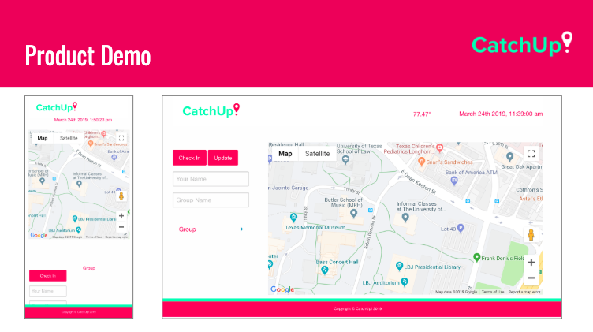

# CatchUp! v1

## Overview

The CatchUp! v1 app was created as Project 1 for The Coding Boot Camp at UT Austin. 

##### Deployed link: (https://derekgeorg.github.io/catchup1/)

| Team members include: |
|-------------------------------------------------------------|
| [James Torres @jamtor1994](https://www.github.com/jamtor1994) | 
| [Ulises Rangel @urangel](https://www.github.com/urangel) |
| [Ken Riley @kriley314](https://www.github.com/kriley314) |
| [Nic Pluymen @nicop93](https://www.github.com/nicop93) |       
| [Derek Georg @derekgeorg](https://www.github.com/derekgeorg)  |

## How it Works
Users can Create or Check-In to a a group by entering their Name and Group Name. Once a user creates or joins a group the browser prompts for their authorization to use their geolocation. Upon approval, that data is used to position the user location on the Map. All users of a specific group can view each others location when joined.

## Motivation for Development

We wanted to provide a simple and secure platform for sharing your location with a group of invited individuals. 

## Application Concept

The CatchUp! web app allows users to create and share private events, allowing friends, families or fans to join. 
Once joined to your group, all members of the event can view each others location, making meeting at a determined location easier.

## The Technology

The CatchUp! web application is able to approximate your location utilizing the Geolocaiton API technology.

Groups, users and their locations are stored using the Firebase database. 

Our frontend framework is built using Foundation. 

#### APIs used: Geolocation; OpenWeather; Google Maps
#### Technologies used: HTML, CSS, Vanilla Javascript, jQuery, AJAX, APIs, Foundation, Moment.js, Git branching workflow; GitHub deployment; Firebase for persistent data storage; Agile software development

## Future Development

* User sign-in using Google or Facebook account
* Directions to another members location based on your current position
* Share Group ID through SMS, Hangouts, Slack, email, etc.

